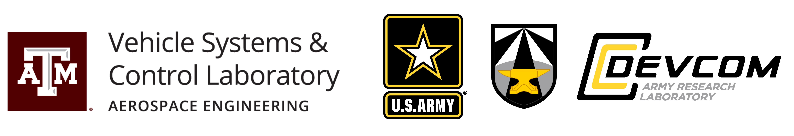

&nbsp;  
### [Vinicius G. Goecks](https://www.vggoecks.com/)<sup>1,2</sup>, [Gregory M. Gremillion](https://scholar.google.com/citations?user=F5GopigAAAAJ&hl=en&oi=ao)<sup>2</sup>, [Vernon J. Lawhern](https://scholar.google.com/citations?user=9tJ4piEAAAAJ&hl=en)<sup>2</sup>,  [John Valasek](https://engineering.tamu.edu/aerospace/profiles/jvalasek.html)<sup>1</sup>, [Nicholas R. Waytowich](http://liinc.bme.columbia.edu/author/nick-waytowich/)<sup>2,3</sup>
{: style="text-align: center"}

#### <sup>1</sup> Texas A&M University, <sup>2</sup>Army Research Laboratory, <sup>3</sup>Columbia University
{: style="text-align: center"}

### Abstract

This paper investigates how to efficiently transition and update policies, trained initially with demonstrations,  using off-policy actor-critic reinforcement learning. It is well-known that techniques based on Learning from Demonstrations, for example behavior cloning, can lead to proficient policies given limited data. However, it is currently unclear how to efficiently update that policy using reinforcement learning as these approaches are inherently optimizing different objective functions. Previous works have used loss functions which combine behavioral cloning losses with reinforcement learning losses to enable this update, however, the components of these loss functions are often set anecdotally, and their individual contributions are not well understood. In this work we propose the Cycle-of-Learning (CoL) framework that uses an actor-critic architecture with a loss function that combines behavior cloning and 1-step Q-learning losses with an off-policy pre-training step from human demonstrations. This enables transition from behavior cloning to reinforcement learning without performance degradation and improves reinforcement learning in terms of overall performance and training time. Additionally, we carefully study the composition of these combined losses and their impact on overall policy learning. We show that our approach outperforms state-of-the-art techniques for combining behavior cloning and reinforcement learning for both dense and sparse reward scenarios. Our results also suggest that directly including the behavior cloning loss on demonstration data helps to ensure stable learning and ground future policy updates.

### Video

To be uploaded.

### Integrating Behavior Cloning and Reinforcement Learning

The Cycle-of-Learning (CoL) framework is a method for transitioning behavior cloning (BC) policies to reinforcement learning (RL) by utilizing an actor-critic architecture with a combined BC+RL loss function and pre-training phase for continuous state-action spaces, in dense- and sparse-reward environments.
The main advantage of using off-policy methods is to re-use previous data to train the agent and reduce the amount of interactions between agent and environment, which is relevant to robotic applications or real-world system where interactions can be costly.

The combined loss function consists of the following components: an expert behavior cloning loss that bounds actor's action to previous human trajectories, $1$-step return Q-learning loss to propagate values of human trajectories to previous states, the actor loss, and a L2 regularization loss on the actor and critic to stabilize performance and prevent over-fitting during training. 
The implementation of each loss component can be seen in our paper ([link](https://arxiv.org/abs/1810.11545)). The weighted combination of the components can be written as

<div style="text-align: center">
{:height="70%" width="70%"}
</div>

Our approach starts by collecting contiguous trajectories from expert policies (in this case, humans) and stores the current and subsequent state-actions pairs, reward received, and task completion signal in a permanent expert memory buffer.
We validate our approach in three environments with continuous observation- and action-space: LunarLanderContinuous-v2 (dense and sparse reward cases) and a custom quadrotor landing task implemented using Microsoft AirSim.

<div style="text-align: center">
{:height="100%" width="100%"}
</div>

During the pre-training phase, the agent samples a batch of trajectories from the expert memory buffer containing expert trajectories to perform updates on the actor and critic networks using the same combined loss function showed above.
This procedure shapes the actor and critic initial distributions to be closer to the expert trajectories and eases the transition from policies learned through expert demonstration to reinforcement learning.

After the pre-training phase, the policy is allowed to roll-out and collect its first on-policy samples, which are stored in a separate first-in-first-out memory buffer with only the agent's samples.
After collecting a given number of on-policy samples, the agent samples a batch of trajectories comprising 25% of samples from the expert memory buffer and 75% from the agent's memory buffer.
This fixed ratio guarantees that each gradient update is grounded by expert trajectories.
If a human demonstrator is used, they can intervene at any time the agent is executing their policy, and add this new trajectories to the expert memory buffer.


### Citation

You can find our complete paper on arXiv ([link](https://arxiv.org/abs/1810.11545)). Please cite our work as showed below:
```
@inproceedings{goecks2019efficiently,
  title={Efficiently combining human demonstrations and interventions for safe training of autonomous systems in real time},
  author={Goecks, Vinicius G and Gremillion, Gregory M and Lawhern, Vernon J and Valasek, John and Waytowich, Nicholas R},
  booktitle={AAAI Conference on Artificial Intelligence (2019). Frames/sec vs Params No GPU},
  volume={140},
  year={2019}
}
```

### Acknowledgments

Research was sponsored by the U.S. Army Research Laboratory and was accomplished under Cooperative Agreement Number W911NF-18-2-0134. The views and conclusions contained in this document are those of the authors and should not be interpreted as representing the official policies, either expressed or implied, of the Army Research Laboratory or the U.S. Government. The U.S. Government is authorized to reproduce and distribute reprints for Government purposes not withstanding any copyright notation herein.


