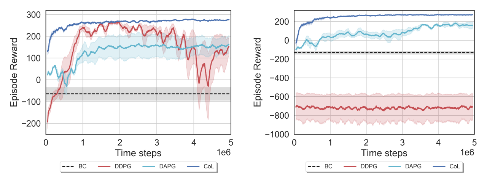
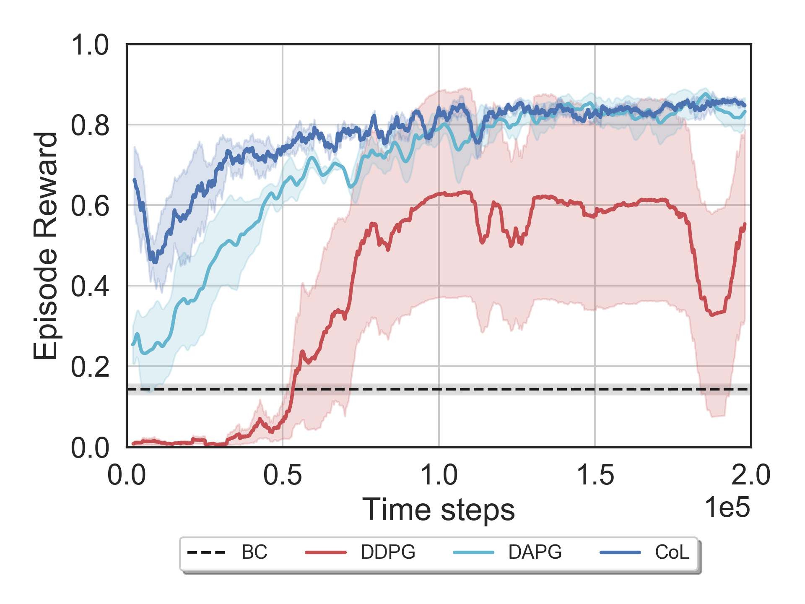

&nbsp;  
## [Vinicius G. Goecks](https://www.vggoecks.com/)<sup>1,2</sup>, [Gregory M. Gremillion](https://scholar.google.com/citations?user=F5GopigAAAAJ&hl=en&oi=ao)<sup>2</sup>, [Vernon J. Lawhern](https://scholar.google.com/citations?user=9tJ4piEAAAAJ&hl=en)<sup>2</sup>,  [John Valasek](https://engineering.tamu.edu/aerospace/profiles/jvalasek.html)<sup>1</sup>, [Nicholas R. Waytowich](http://liinc.bme.columbia.edu/author/nick-waytowich/)<sup>2,3</sup>
{: style="text-align: center"}

### <sup>1</sup> Texas A&M University, <sup>2</sup>Army Research Laboratory, <sup>3</sup>Columbia University
{: style="text-align: center"}

### This work investigates how to efficiently transition and update policies, trained initially with demonstrations, using off-policy actor-critic reinforcement learning. In this work we propose the Cycle-of-Learning (CoL) framework that uses an actor-critic architecture with a loss function that combines behavior cloning and 1-step Q-learning losses with an off-policy pre-training step from human demonstrations. This enables transition from behavior cloning to reinforcement learning without performance degradation and improves reinforcement learning in terms of overall performance and training time. Additionally, we carefully study the composition of these combined losses and their impact on overall policy learning and show that our approach outperforms state-of-the-art techniques for combining behavior cloning and reinforcement learning for both dense and sparse reward scenarios.

## [[Read the Paper](https://arxiv.org/abs/1910.04281)|[Supplemental Material](https://github.com/viniciusguigo/cycle-of-learning/blob/master/docs/CoL_AAMAS20_appendix.pdf)]
{: style="text-align: center"}

## Video

Click on the image below to watch the video:

[](http://www.youtube.com/watch?v=AQwsk6kZfok "AAMAS-20: The Cycle-of-Learning")

## Proposed Approach

The Cycle-of-Learning (CoL) framework is a method for transitioning behavior cloning (BC) policies to reinforcement learning (RL) by utilizing an actor-critic architecture with a combined BC+RL loss function and pre-training phase for continuous state-action spaces, in dense- and sparse-reward environments.
This combined BC+RL loss function consists of the following components: an expert behavior cloning loss that bounds actor's action to previous human trajectories, 1-step return Q-learning loss to propagate values of human trajectories to previous states, the actor loss, and a L2 regularization loss on the actor and critic to stabilize performance and prevent over-fitting during training. 
The implementation of each loss component can be seen in our paper ([link](https://arxiv.org/abs/1910.04281)). The weighted combination of the components can be written as

<div style="text-align: center">
{:height="100%" width="100%"}
</div>

Our approach starts by collecting contiguous trajectories from expert policies (in this case, humans) and stores the current and subsequent state-actions pairs, reward received, and task completion signal in a permanent expert memory buffer.
We validate our approach in three environments with continuous observation- and action-space: LunarLanderContinuous-v2 (dense and sparse reward cases) and a custom quadrotor landing task with wind disturbance implemented using Microsoft AirSim.

<div style="text-align: center">
{:height="100%" width="100%"}
</div>

The data collection is followed by a pre-trainig phase. During this phase, the agent samples a batch of trajectories from the expert memory buffer containing expert trajectories to perform updates on the actor and critic networks using the same combined loss function showed above.
This procedure shapes the actor and critic initial distributions to be closer to the expert trajectories and eases the transition from policies learned through expert demonstration to reinforcement learning.

After the pre-training phase, the policy is allowed to roll-out and collect its first on-policy samples, which are stored in a separate first-in-first-out memory buffer with only the agent's samples.
After collecting a given number of on-policy samples, the agent samples a batch of trajectories comprising 25% of samples from the expert memory buffer and 75% from the agent's memory buffer.
This fixed ratio guarantees that each gradient update is grounded by expert trajectories.
If a human demonstrator is used, they can intervene at any time the agent is executing their policy, and add this new trajectories to the expert memory buffer.

We compare our approach against state-of-the-art baselines, including BC, DDPG, and DAPG, and demonstrate the the main advantages of our method in terms of learning speed, stability, and performance with respect to them.

The first environment we evaluate our approach is the LunarLanderContinuous-v2 by OpenAI Gym, for the dense and sparse reward cases. The dense reward case is the default for this environment and reward is computed based on how well the agent drives the lander to the landing pad and lands without crashing it. The sparse case uses the same reward function but instead of giving it to the agent at every time step, the reward is summed and stored and given to the agent just at the final time step.
Figures below shows the CoL performance in these two environments (dense and sparse reward cases, respectively) compared to the baselines followed by a visualization of the policies after training.

<div style="text-align: center">
{:height="100%" width="100%"}
</div>

<!-- <div style="text-align: center">
{:height="85%" width="85%"}
</div> -->

We also evaluated our algorithm on a quadrotor landing task with wind disturbance implemented using [Microsoft AirSim](https://github.com/microsoft/AirSim), a high-fidelity autonomous vehicle simulator. We repeated the same experiment and compared the CoL performance to the same baselines. The figure below shows the training curves followed by a visualization of the trained policies.

<div style="text-align: center">
{:height="50%" width="50%"}
</div>

<!-- <div style="text-align: center">
{:height="85%" width="85%"}
</div> -->


Several component analyses were performed to evaluate the impact of each of the critical elements of the CoL on learning.
These respectively include the effects of pre-training (with pre-training, CoL, or without it, CoL-PT), the combined loss function (no combined loss, BC+DDPG, and CoL without behavior cloning loss, CoL-BC), and the sample composition of the experience replay buffer (fixed ratio of expert and agent samples, CoL, or using prioritized experience replay, CoL+PER, for both sparse, S, and dense reward cases, marked with D), as showed in the figures below:

<div style="text-align: center">
{:height="100%" width="100%"}
</div>

Further, the capability our approach provides, to transition from a limited number of human demonstrations to a baseline behavior cloning agent and subsequent improvement through reinforcement learning without significant losses in performance, is largely motivated by the goal of human-in-the-loop learning on physical system.
Thus our aim is to integrate this method onto such systems and demonstrate rapid, safe, and stable learning from limited human interaction.

## Citation

You can find our complete paper on arXiv ([link](https://arxiv.org/abs/1910.04281)). Please cite our work as showed below:
```
@misc{goecks2019integrating,
    title={Integrating Behavior Cloning and Reinforcement Learning for Improved Performance in Sparse Reward Environments},
    author={Vinicius G. Goecks and Gregory M. Gremillion and Vernon J. Lawhern and John Valasek and Nicholas R. Waytowich},
    year={2019},
    eprint={1910.04281},
    archivePrefix={arXiv},
    primaryClass={cs.LG}
}
```

## Acknowledgments

Research was sponsored by the U.S. Army Research Laboratory and was accomplished under Cooperative Agreement Number W911NF-18-2-0134. The views and conclusions contained in this document are those of the authors and should not be interpreted as representing the official policies, either expressed or implied, of the Army Research Laboratory or the U.S. Government. The U.S. Government is authorized to reproduce and distribute reprints for Government purposes not withstanding any copyright notation herein.


